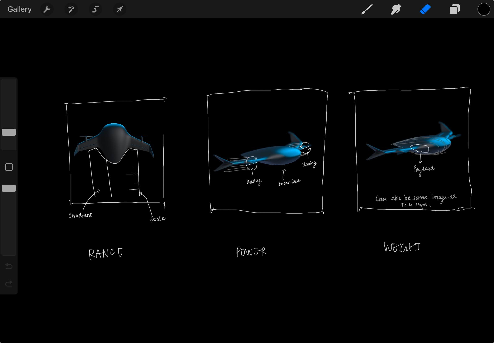
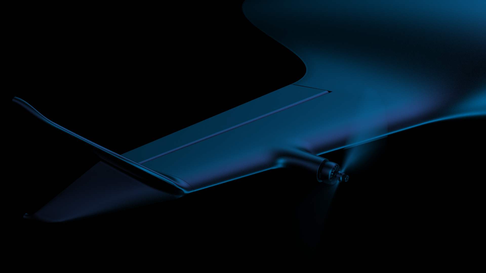
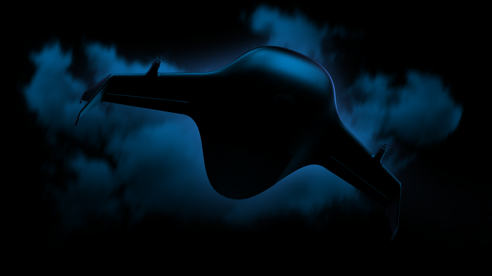

import Callout from "@/components/Callout.astro";
import VideoPlayer from '@/components/VideoPlayer.astro';

## Project Brief

| Role | Team Size | Platform | Tools | Duration |
|:-----|:----------|:---------|:------|:---------|
| Lead Product Designer & Dev. | 2 PD | Webflow | Figma, Notion | 6 weeks |

## Challenge

Create a professional website for Airbound, a drone technology startup, that effectively communicates their innovative approach to logistics and attracts diverse stakeholders, including investors and potential employees.[^1]

<Callout type="info">
  The drone technology market is projected to reach $50 billion by 2028, making it crucial for startups like Airbound to establish a strong online presence to attract investors and talent.
</Callout>

## Status Quo

Prior to this project, Airbound lacked a comprehensive web presence, limiting their ability to:

- Capitalize on media coverage following recent funding
- Provide centralized information for various stakeholders
- Showcase their unique technology and company culture
- Attract top talent and potential investors

*Airbound website mobile preview*

## Process

1. **Discovery Phase**
   - Analyzed Airbound's vision and value proposition
   - Understood the company's journey
   - Identified key product specifications and technological advantages
   - Defined primary user groups

2. **Brand and Visual Style Development**
   - Leveraged existing brand guidelines
   - Emphasized Airbound's contrarian and youthful brand personality
   - Incorporated visuals of drone technology

3. **Information Architecture and Content Strategy**
   - Structured content for different user groups
   - Planned key pages: Home, Technology, Careers, Contact

4. **Design and Prototyping**
   - Created wireframes and high-fidelity mockups
   - Developed interactive prototypes

   
   *Screenshot of my Procreate file while ideating*
   
   .jpg>)
   *Screenshot of my Procreate file while ideating*

5. **Development and Launch**
   - Built the website using Webflow
   - Conducted quality assurance and performance optimization
   - Launched on [https://airbound.co/](https://airbound.co/)

### Micro-Interactions and Features

1. **Timeline Animation for Progress Tracking**: 
   Introduced a timeline animation to guide users through the product's journey, providing visual feedback and enhancing user engagement by highlighting key milestones and stages.[^2]

   <VideoPlayer src="https://designhawk.cdn.prismic.io/designhawk/ZozXQR5LeNNTw61f_2024-07-0911-02-48.mp4"/>

2. **Hero Animation with Product Reveal**: 
   Implemented a dynamic hero animation that showcases the product upon page load, capturing user attention and effectively communicating the product's unique value proposition through visual storytelling.

   <VideoPlayer src="https://designhawk.cdn.prismic.io/designhawk/ZozXRB5LeNNTw61h_2024-07-0911-02-10.mp4"/>

3. **Interactive Feature Cards with Product Animation**: 
   Designed feature cards with subtle animations that reveal product functionalities as users interact with them, making the experience more engaging and informative.

   <VideoPlayer src="https://designhawk.cdn.prismic.io/designhawk/ZozXRh5LeNNTw61i_2024-07-0911-01-44.mp4"/>

4. **Hero Animation for Tech Page with Drone Landing Stance**: 
   Developed a captivating hero animation for the tech page, featuring a drone landing stance to illustrate technological advancements and capture the essence of innovation, ensuring a memorable first impression for users.

   <VideoPlayer src="https://designhawk.cdn.prismic.io/designhawk/ZozXRx5LeNNTw61j_2024-07-0911-01-27.mp4"/>

<Callout type="warning">
  Ensure that all animations and video content are optimized for performance to maintain smooth playback across various devices. Provide fallback options for browsers that don't support video.
</Callout>

### Final Result Showcase

## Learnings

1. **Brand Personality Drives Differentiation:** 

   
   *Infusing Airbound's "crazy" revolutionary spirit throughout the design set them apart in a crowded market landscape.*

2. **Visual Narratives Amplify Message:** 

   
   *Leveraging a mix of animations and video content powerfully conveyed Airbound's technological prowess and mission.*

[^1]: The drone technology market is projected to reach $50 billion by 2028, making it crucial for startups like Airbound to establish a strong online presence to attract investors and talent.

[^2]: The timeline animation was optimized for performance, ensuring smooth playback even on lower-end devices, with a fallback static image for browsers that don't support video.