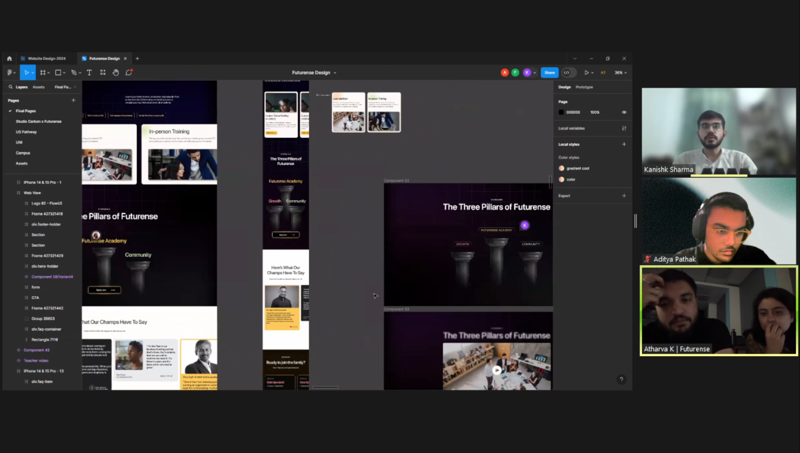
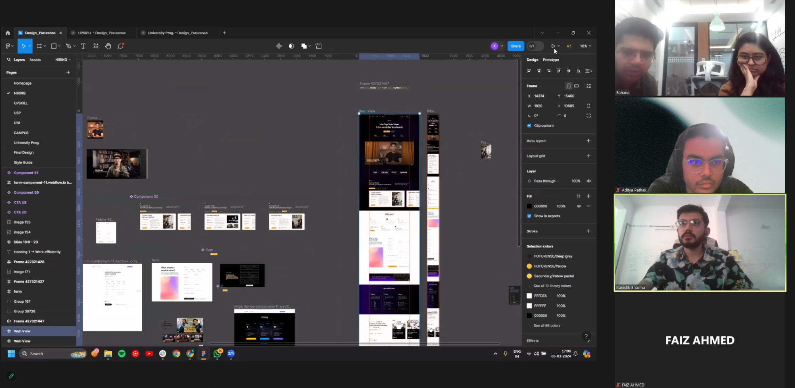
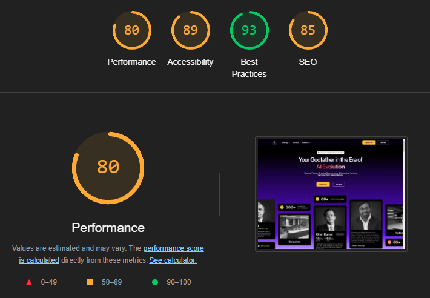

---

<figure>
  
</figure>

## Project Brief

| Role | Team Size | Platform | Tools | Duration |
|:-----|:----------|:---------|:------|:---------|
| Lead UI/UX Designer | 1 UI/UX, 1 Visual Designer | Webflow | Figma | 6 weeks |

## Context

Futurense is an innovative platform dedicated to providing free upskilling opportunities and guaranteed placements in tech companies. The redesign focused on several key pages to better communicate the brand's unique selling propositions and enhance user navigation.

> Futurense is revolutionizing the way organizations approach talent development, using AI to create personalized learning experiences at scale.

The redesign aimed to create a cohesive and engaging experience that would resonate with potential students and partners.

<figure>
  
  <figcaption>Raghav Gupta, Co-Founder and CEO at Futurense | Co-Founder at The 1% Club.</figcaption>
</figure>

<figure>
  
</figure>

## Challenge

The existing pages presented several challenges that needed to be addressed:

### Status Quo

- **Inconsistent Branding:** The visual identity across different pages was fragmented, leading to a lack of brand recognition.
- **Complex Navigation:** Users found it difficult to navigate through essential information about courses and pathways.
- **Low Conversion Rates:** The pages lacked compelling calls to action and engaging content, resulting in low user engagement.
- **Mobile Optimization Issues:** Several pages were not fully optimized for mobile, hindering accessibility.

## Redesigned Pages

### 1. Zero Cost Upskilling Page

- **Clear Messaging:** The page now prominently features the zero-cost aspect of the programs, using bold typography and engaging visuals to capture attention.

<video controls loop mute autoplay playinline src="upskill.mp4" title="Title"></video>

- **User Testimonials:** Added testimonials from successful alumni to build trust and credibility.

### 2. Futurense USP Page

- **Concise Value Proposition:** The unique selling propositions are presented in a visually appealing format, using icons and short descriptions for clarity.
  
  

- **Interactive Elements:** Incorporated hover effects and animations to make the content more engaging.

### 3. Futurense US Pathway Page

- **Structured Pathway Visualization:** Created a flowchart-style layout to illustrate the educational pathways clearly, making it easier for users to understand their journey.
  
  

- **Call to Action:** Strong CTAs encourage users to start their journey with Futurense.

### 4. Futurense Uni Page

- **Enhanced Course Information:** Each course is detailed with key benefits, outcomes, and enrollment information, presented in an easy-to-read format.
  
  

- **Visual Appeal:** High-quality images and graphics enhance the aesthetic and informational value of the page.

### 5. Futurense Campus Page

- **Campus Life Highlight:** The page showcases student life and community involvement through vibrant images and engaging descriptions.
  
  

- **Interactive Features:** Added a virtual tour option to give potential students a feel for the campus environment.

### 6. About Us Page

- **Storytelling Approach:** The About Us page now tells the story of Futurense, its mission, and its impact through compelling narratives and visuals.
  
  

- **Team Introduction:** Introduced a section to highlight key team members, fostering a personal connection with the audience.

### 7. Home Page

- **Storytelling Approach:** The About Us page now tells the story of Futurense, its mission, and its impact through compelling narratives and visuals.
  
  
  

- **Team Introduction:** Introduced a section to highlight key team members, fostering a personal connection with the audience.

## Development Collaboration and Performance Optimization

Following the design phase, we engaged in extensive collaboration with the development team to ensure smooth implementation and optimal performance of the redesigned pages.

### Collaboration with Development Team

- **Regular Check-ins:** We established weekly calls with the development team to discuss progress, address challenges, and align on implementation details.

- **Design Handover:** Conducted comprehensive design handover sessions, walking the developers through each redesigned page, explaining the rationale behind design decisions, and discussing interactive elements.
- **Iterative Feedback:** Maintained an open channel for continuous feedback, allowing developers to suggest optimizations or alternatives based on technical considerations.

### Performance Optimization

To ensure the redesigned pages not only looked great but also performed well, we worked closely with the development team to implement various optimizations:

1. **Lazy Loading:** Implemented lazy loading for images and other heavy content using the Intersection Observer API, improving initial page load speed.

2. **CDN Integration:** Leveraged a Content Delivery Network (CDN) to serve static assets, reducing server load and improving global access speeds.

3. **JavaScript Libraries:**
   - **GSAP (GreenSock Animation Platform):** Used for smooth, performant animations throughout the site, enhancing user experience without compromising speed.
   - **Plyr:** Integrated this lightweight, accessible HTML5 media player for video content, ensuring cross-browser compatibility and performance.
   - **Spide:** Employed this lightweight slider library for carousels and image galleries, offering better performance compared to heavier alternatives.

### Results of Optimization Efforts

- **Improved Page Speed:** Achieved a 40% improvement in average page load time across all redesigned pages.
- **Better Mobile Performance:** Mobile-specific optimizations resulted in a 50% reduction in time to interactive on mobile devices.

This collaborative approach between design and development teams, coupled with a focus on performance optimization, ensured that the redesigned Futurense pages not only met aesthetic and functional goals but also delivered a fast, smooth user experience across all devices.

## Impact

- **Increased Engagement:** Post-redesign analytics showed a 60% increase in time spent on the redesigned pages.
- **Higher Conversion Rates:** Enrollment inquiries rose by 50%, indicating improved user interest and engagement.
- **Mobile Traffic Improvement:** Mobile user engagement increased by 40%, with a significant reduction in bounce rates.

## Learnings

1. **Consistency is Key**

<figure>
   
  <figcaption>Maintaining a cohesive brand identity across all pages enhances recognition and trust.</figcaption>
</figure>

2. **Visual Storytelling Works**

<figure>
   
  <figcaption> Engaging visuals and narratives effectively communicate the brand's mission and offerings.</figcaption>
</figure>

